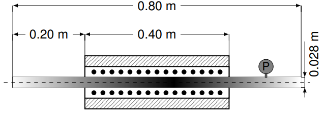

# Analysis of acetylene pyrolysis

Analysis of acetylene kinetics under conditions relevant to gas carburizing. The study is conducted with a DRG skeletal mechanism and comprise both PFR
1-D simulations and 3-D CFD cases. All cases are validated experimentally and data is made available for verification.

Data explored in this paper is provided in my [PhD thesis](http://docnum.univ-lorraine.fr/public/DDOC_T_2017_0158_DAL_MAZ_SILVA.pdf), mainly in Chapter 5. The kinetics mechanisms used in this study are provided in different formats at:

- [DRG skeletal mechanism tested in this work](https://github.com/wallytutor/archive-databases/tree/main/kinetics/Dalmazsi_2017_sk41)
- [Norinaga's reference detailed mechanism](https://github.com/wallytutor/archive-databases/tree/main/kinetics/Norinaga_2009)

## Summary of calculations

- [x] [Verification of mechanisms with PSR models with Cantera and chemFoam](simulations/chemFoam)
- [ ] [Simulation of experimental conditions with a non-isothermal PFR](src/legacy/)
- [ ] [Extension to real geometry of reactor with OpenFOAM](simulations/reactingFoam)

## To-do's

- [ ] Validate new release of PFR model with wall temperature / simulate.
- [ ] Migrate FOAM case preparation from Python to Julia (*majordome*).
- [ ] Run FOAM mesh convergence/simulations and extract results.
- [ ] Add Graf (2007) as a baseline comparison to paper.
- [ ] Export mechanism with pyJac and benchmark in FOAM.
- [ ] Finish paper text and publish.
