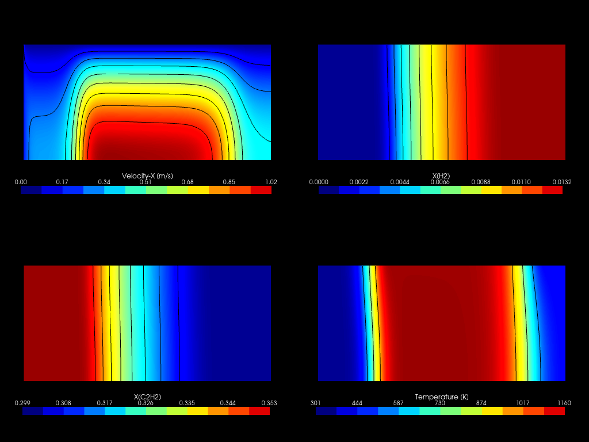

---
jupyter:
  jupytext:
    text_representation:
      extension: .md
      format_name: markdown
      format_version: '1.3'
      jupytext_version: 1.14.6
  kernelspec:
    display_name: Python 3 (ipykernel)
    language: python
    name: python3
---

# Analysis of acetylene pyrolysis

Analysis of acetylene kinetics under conditions relevant to gas carburizing. The study is conducted with a DRG skeletal mechanism and comprise both PFR
1-D simulations and 3-D CFD cases. All cases are validated experimentally and data is made available for verification.

## About

Data explored in this paper is provided in my [PhD thesis](http://docnum.univ-lorraine.fr/public/DDOC_T_2017_0158_DAL_MAZ_SILVA.pdf), mainly in Chapter 5. The kinetics mechanisms used in this study are provided in different formats at:

- [DRG skeletal mechanism tested in this work](https://github.com/wallytutor/archive-databases/tree/main/kinetics/Dalmazsi_2017_sk41)
- [Norinaga's reference detailed mechanism](https://github.com/wallytutor/archive-databases/tree/main/kinetics/Norinaga_2009)

## Summary of calculations

- [x] Verification of mechanisms with PSR models with Cantera and chemFoam (this file)
- [ ] [Simulation of experimental conditions with a non-isothermal PFR](src/pfr/)
- [ ] [Extension to real geometry of reactor with OpenFOAM](src/foam/)

## To-do's

- [ ] Validate new release of PFR model with wall temperature / simulate.
- [ ] Migrate FOAM case preparation from Python to Julia (*majordome*).
- [ ] Run FOAM mesh convergence/simulations and extract results.
- [ ] Add Graf (2007) as a baseline comparison to paper.
- [ ] Export mechanism with pyJac and benchmark in FOAM.
- [ ] Finish paper text and publish.

## Comparison of Cantera and chemFoam

In this notebook we compare results obtained for a perfect-stirred reactor (PSR) using Cantera and chemFoam (the zero-dimensional kinetics solver of OpenFOAM). This is done with the original mechanism by Norinaga (2009) comprised of 243 species and the one obtained in my thesis through extensive DRG skeletal combinations.

```python
%load_ext autoreload
%autoreload 2
```

```python
from pathlib import Path
import cantera as ct
from papertools import report_dimensionless
from papertools import compare_cantera_chemfoam
```

Mechanisms are stored in another [repository](https://github.com/wallytutor/archive-databases/tree/main) and have been cloned relative to the root of the current one. Below we assembly the paths to retrieve Cantera files.

```python
databases = Path("../../archive-databases/kinetics/")

norinaga2009 = "Norinaga_2009/CT-hydrocarbon-norinaga-2009-mech.yaml"
dalmazsi2017 = "Dalmazsi_2017_sk41/CT-hydrocarbon-dalmazsi-2017-mech.yaml"

norinaga2009 = databases / norinaga2009
dalmazsi2017 = databases / dalmazsi2017
```

Next we compute the reference initial conditions in required units. Since acetylene is stored in liquid acetone, pollution of the gas is expected are discussed by Noringa (2009). Chemical composition is provided in mole fractions, a more convenient quantity when dealing with low pressure gas phases.

```
  gas:

       temperature   1173.2 K
          pressure   5000 Pa
           density   0.014098 kg/m^3
  mean mol. weight   27.503 kg/kmol
   phase of matter   gas

                          1 kg             1 kmol     
                     ---------------   ---------------
          enthalpy        4.2021e+06        1.1557e+08  J
   internal energy        3.8474e+06        1.0582e+08  J
           entropy             10261        2.8221e+05  J/K
    Gibbs function       -7.8355e+06        -2.155e+08  J
 heat capacity c_p            1741.7             47901  J/K
 heat capacity c_v            1439.4             39587  J/K

                      mass frac. Y      mole frac. X     chem. pot. / RT
                     ---------------   ---------------   ---------------
              C2H2           0.33401            0.3528           -9.0479
               CH4        0.00041999           0.00072           -43.879
          CH3COCH3          0.013684           0.00648           -73.972
                N2           0.65189              0.64           -28.735
     [  +37 minor]                 0                 0  

Viscosity... 3.965682e-05 Pa.s
Re   ....... 3.555050e+02
Pr_D ....... 8.671141e-01
Pe_D ....... 3.082634e+02
```

```python
# Temperature [K]
T = 1173.15

# Pressure [Pa]
P = 5000.0

# Relative C2H2 mole fraction.
C = 0.36

# Dictionary of detailed mole fractions.
X = {"N2":       0.64,
     "C2H2":     0.980 * C,
     "CH3COCH3": 0.018 * C,
     "CH4":      0.002 * C}

# Velocity [m/s]
U = 1.0

# Length [m]
L = 1.0

report_dimensionless(dalmazsi2017, T, P, X, L, U)
```

## DRG mechanism

```
Cantera:
 T = 1298.8, p = 5000, C2H2 = 0.242606, CH4 = 0.001410

OpenFOAM:

 T = 1299.9, p = 5000, C2H2 = 0.24196, CH4 = 0.00141113
```

```python
compare_cantera_chemfoam(dalmazsi2017, "psr-dalmazsi-2017", T, P, X)
```

## Detailed mechanism

```
Cantera:
 T = 1299.7, p = 5000, C2H2 = 0.240127, CH4 = 0.001216

OpenFOAM:

 T = 1301.02, p = 5000, C2H2 = 0.239335, CH4 = 0.00121622
```

```python
compare_cantera_chemfoam(norinaga2009, "psr-norinaga-2009", T, P, X)
```

<!-- #region -->
## Afterword: `chemFoam` tutorial

Dictionaries for `chemFoam` are quite simple, we only need the following folders/files:


### `system/`

- `controlDict`: there we set the system to integrate over one physical second and store only the final state.

- `fvSchemes`: the only definition in regards the time-derivative: explicit solver `Euler` is expected here.

- `fvSolution`: only the integrated species content `Yi` is required.

### `constants/`

- `chemistryProperties`: provides ODE problem parameters. The most important feature here is the use of `seulex` integrator, this being reported to provide the best treatment of stiff systems from chemical kinetics.

- `initialConditions`: we provide the values for automatic generation of `0/` directory. It is a particularity of `chemFoam` that it generates that directory by processing this dictionary. Here we define the reactor to be held at constant pressure and state that composition is provided in mole fractions.

- `thermophysicalProperties`: a `chemistryReader` is provided to be able to interpret mechanism files in the required format. It is recommended to perform conversion for Chemkin II format and check files for any errors, giving preference to OpenFOAM own format here. The use of `<constant>` means the files are to be stored in the `constant/` case directory.
<!-- #endregion -->

## Summary of CFD results

<table>
    <tr>
        <td style="text-align: center;" width="50px">Case</td>
        <td style="text-align: center;" width="150px">Measured</td>
        <td style="text-align: center;" width="150px">PFR (Norinaga, 2009)</td>
        <td style="text-align: center;" width="150px">CFD (Skeletal model)</td> 
    </tr>
    <tr>
        <td style="text-align: center;">4</td>
        <td style="text-align: center;">0.346</td>
        <td style="text-align: center;">0.340</td>
        <td style="text-align: center;">0.336</td> 
    </tr>
    <tr>
        <td style="text-align: center;">5</td>
        <td style="text-align: center;">0.312</td>
        <td style="text-align: center;">0.321</td>
        <td style="text-align: center;">0.319</td> 
    </tr>
    <tr>
        <td style="text-align: center;">6</td>
        <td style="text-align: center;">0.307</td>
        <td style="text-align: center;">0.302</td>
        <td style="text-align: center;">0.299</td> 
    </tr>
    <tr>
        <td style="text-align: center;">7</td>
        <td style="text-align: center;">0.288</td>
        <td style="text-align: center;">0.287</td>
        <td style="text-align: center;">0.286</td> 
    </tr>
    <tr>
        <td style="text-align: center;">8</td>
        <td style="text-align: center;">0.323</td>
        <td style="text-align: center;">0.327</td>
        <td style="text-align: center;">0.323</td> 
    </tr>
    <tr>
        <td style="text-align: center;">9</td>
        <td style="text-align: center;">0.314</td>
        <td style="text-align: center;">0.320</td>
        <td style="text-align: center;">0.314</td> 
    </tr>
    <tr>
        <td style="text-align: center;">10</td>
        <td style="text-align: center;">0.249</td>
        <td style="text-align: center;">0.230</td>
        <td style="text-align: center;">0.234</td> 
    </tr>
    <tr>
        <td style="text-align: center;">11</td>
        <td style="text-align: center;">0.226</td>
        <td style="text-align: center;">0.219</td>
        <td style="text-align: center;">0.222</td> 
    </tr>
    <tr>
        <td style="text-align: center;">12</td>
        <td style="text-align: center;">0.201</td>
        <td style="text-align: center;">0.208</td>
        <td style="text-align: center;">0.216</td> 
    </tr>
    <tr>
        <td style="text-align: center;">13</td>
        <td style="text-align: center;">0.343</td>
        <td style="text-align: center;">0.342</td>
        <td style="text-align: center;">0.338</td> 
    </tr>
    <tr>
        <td style="text-align: center;">14</td>
        <td style="text-align: center;">0.298</td>
        <td style="text-align: center;">0.292</td>
        <td style="text-align: center;">0.292</td> 
    </tr>
</table>

<center>
    <!-- <h3>Case No. 4</h3>
    
    <h3>Case No. 5</h3>
    
    <h3>Case No. 6</h3>
    
    <h3>Case No. 7</h3>
    
    <h3>Case No. 8</h3>
     -->
    <h3>Case No. 9</h3>
    
    <!-- <h3>Case No. 10</h3>
    
    <h3>Case No. 11</h3>
    
    <h3>Case No. 12</h3>
    
    <h3>Case No. 13</h3>
    
    <h3>Case No. 14</h3>
     -->
</center>
