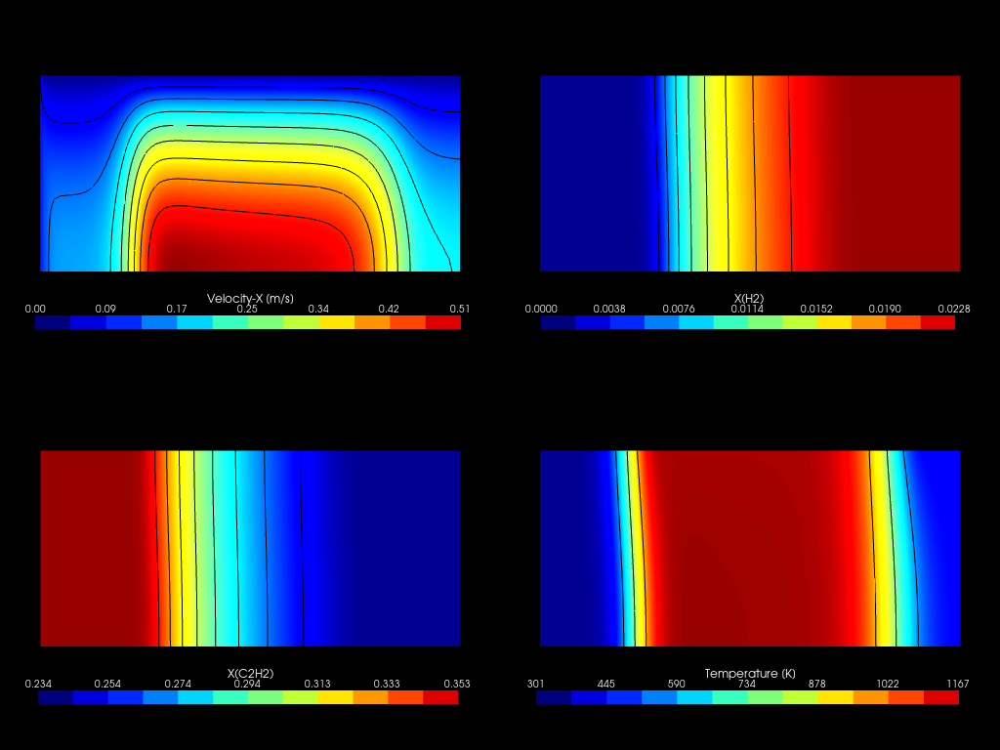

---
jupyter:
  jupytext:
    text_representation:
      extension: .md
      format_name: markdown
      format_version: '1.3'
      jupytext_version: 1.14.5
  kernelspec:
    display_name: Python 3 (ipykernel)
    language: python
    name: python3
---

# Analysis of acetylene pyrolysis

Analysis of acetylene kinetics under conditions relevant to gas carburizing. The study is conducted with a DRG skeletal mechanism and comprise both PFR
1-D simulations and 3-D CFD cases. All cases are validated experimentally and data is made available for verification.

## About

Data explored in this paper is provided in my [PhD thesis](http://docnum.univ-lorraine.fr/public/DDOC_T_2017_0158_DAL_MAZ_SILVA.pdf), mainly in Chapter 5. The kinetics mechanisms used in this study are provided in different formats at:

- [DRG skeletal mechanism tested in this work](https://github.com/wallytutor/archive-databases/tree/main/kinetics/Dalmazsi_2017_sk41)
- [Norinaga's reference detailed mechanism](https://github.com/wallytutor/archive-databases/tree/main/kinetics/Norinaga_2009)

## Summary of calculations

- [x] [Verification of mechanisms with PSR models with Cantera and chemFoam](simulations/chemFoam)
- [ ] [Simulation of experimental conditions with a non-isothermal PFR](src/pfr/)
- [ ] [Extension to real geometry of reactor with OpenFOAM](src/foam/)

## To-do's

- [ ] Validate new release of PFR model with wall temperature / simulate.
- [ ] Migrate FOAM case preparation from Python to Julia (*majordome*).
- [ ] Run FOAM mesh convergence/simulations and extract results.
- [ ] Add Graf (2007) as a baseline comparison to paper.
- [ ] Export mechanism with pyJac and benchmark in FOAM.
- [ ] Finish paper text and publish.

```python
%load_ext autoreload
%autoreload 2
```

```python
from pathlib import Path
import cantera as ct
import numpy as np
import pandas as pd
import pyvista as pv
from papertools import report_dimensionless
from papertools import compare_cantera_chemfoam
from papertools import fit_wall_temperature
from papertools import generate_wall_bc
from papertools import plot_mesh
```

```python
pv.set_jupyter_backend("static")
# pv.start_xvfb()
```

## Reactor geometry and temperature profile

A sketch of the chemical reactor is provided below. Gas inlet is made by the left side in the diameter of 28 mm and flows at about room temperature until reaching the heated chamber at 20 cm. Pressure is measured at outlet and this will be important later for proper setup of boundary conditions.

<center></center>

To fit a function of wall temperature profile the following table is used. Notice here that measurements do not cover the full 80 cm of the reactor, but are in fact centered in the hot zone across a length of 52 cm. The first 3 rows we manually added (not actual measurements, so heated chamber starts actually at 12 cm) to provide a physically suitable shape for fitting the curve. Same was done on last row because measurement on chamber exit was highly unreliable because of thermocouple placement and contact with the wall.

As we observe on row 7, temperature in the middle of the reactor heated zone does not reach the set-point value. Below we verify that actually abot 99% of the value is actually reached and this is an important factor for a proper kinetics simulation given the exponential role of activation energies.

Given the increasing-plateau-decreasing shape of the profile, a composition of sigmoid functions is proposed as a model for the data. The function is evaluated in terms of temperature and has a physical parameter `T_sp` for set-point temperature. Other parameters are fitted to match the profile. Parameters `a1`/`a2` provide the inflexion points and `m1`/`m2` the slopes of uphill/downhill profiles. We make use of `scipy.optimize.curve_fit` to find the unknown parameters and visualize the results.

We translate the fitted function in C++ and create a `codedFixedValue` boundary condition for enforcing the profile.

Below we illustrate the generation of a coded boundary condition from one of the cases.

```python
generate_wall_bc(params.iloc[4].to_dict())
```

## Setup of CFD cases

Cases below 1073 K may be skipped because there is no decomposition of acetylene for the given residence times.

```python
cpos = ((0.3, 0.005, 1.0),
        (0.3, 0.005, 0.0),
        (0.0, 0.000, 0.0))

mtm = np.diag([1, 20, 1, 1])

plot_mesh("cfd-dalmazsi-2017-base/wedge.msh", cpos=cpos, mtm=mtm)
```

```python
conditions = pd.DataFrame([
    {"N":  1, "P":  5000, "Q": 222, "T":  773, "X": 0.352},
    {"N":  2, "P":  5000, "Q": 222, "T":  873, "X": 0.364},
    {"N":  3, "P":  5000, "Q": 222, "T":  973, "X": 0.364},
    {"N":  4, "P":  5000, "Q": 222, "T": 1073, "X": 0.346},
    {"N":  5, "P":  5000, "Q": 222, "T": 1123, "X": 0.312},
    {"N":  6, "P":  5000, "Q": 222, "T": 1173, "X": 0.307},
    {"N":  7, "P":  5000, "Q": 222, "T": 1273, "X": 0.298},
    {"N":  8, "P":  3000, "Q": 222, "T": 1173, "X": 0.323},
    {"N":  9, "P":  3000, "Q": 222, "T": 1223, "X": 0.314},
    {"N": 10, "P": 10000, "Q": 222, "T": 1173, "X": 0.249},
    {"N": 11, "P": 10000, "Q": 222, "T": 1223, "X": 0.226},
    {"N": 12, "P": 10000, "Q": 222, "T": 1273, "X": 0.201},
    {"N": 13, "P": 10000, "Q": 378, "T": 1023, "X": 0.343},
    {"N": 14, "P": 10000, "Q": 378, "T": 1123, "X": 0.298},
]).set_index("N")
```

## Summary of CFD results

<table>
    <tr>
        <td style="text-align: center;" width="50px">Case</td>
        <td style="text-align: center;" width="150px">Measured</td>
        <td style="text-align: center;" width="150px">PFR (Norinaga, 2009)</td>
        <td style="text-align: center;" width="150px">CFD (Skeletal model)</td> 
    </tr>
    <tr>
        <td style="text-align: center;">4</td>
        <td style="text-align: center;">0.346</td>
        <td style="text-align: center;">0.340</td>
        <td style="text-align: center;">0.336</td> 
    </tr>
    <tr>
        <td style="text-align: center;">5</td>
        <td style="text-align: center;">0.312</td>
        <td style="text-align: center;">0.321</td>
        <td style="text-align: center;">0.319</td> 
    </tr>
    <tr>
        <td style="text-align: center;">6</td>
        <td style="text-align: center;">0.307</td>
        <td style="text-align: center;">0.302</td>
        <td style="text-align: center;">0.299</td> 
    </tr>
    <tr>
        <td style="text-align: center;">7</td>
        <td style="text-align: center;">0.288</td>
        <td style="text-align: center;">0.287</td>
        <td style="text-align: center;">0.286</td> 
    </tr>
    <tr>
        <td style="text-align: center;">8</td>
        <td style="text-align: center;">0.323</td>
        <td style="text-align: center;">0.327</td>
        <td style="text-align: center;">0.323</td> 
    </tr>
    <tr>
        <td style="text-align: center;">9</td>
        <td style="text-align: center;">0.314</td>
        <td style="text-align: center;">0.320</td>
        <td style="text-align: center;">0.314</td> 
    </tr>
    <tr>
        <td style="text-align: center;">10</td>
        <td style="text-align: center;">0.249</td>
        <td style="text-align: center;">0.230</td>
        <td style="text-align: center;">0.234</td> 
    </tr>
    <tr>
        <td style="text-align: center;">11</td>
        <td style="text-align: center;">0.226</td>
        <td style="text-align: center;">0.219</td>
        <td style="text-align: center;">0.222</td> 
    </tr>
    <tr>
        <td style="text-align: center;">12</td>
        <td style="text-align: center;">0.201</td>
        <td style="text-align: center;">0.208</td>
        <td style="text-align: center;">0.216</td> 
    </tr>
    <tr>
        <td style="text-align: center;">13</td>
        <td style="text-align: center;">0.343</td>
        <td style="text-align: center;">0.342</td>
        <td style="text-align: center;">0.338</td> 
    </tr>
    <tr>
        <td style="text-align: center;">14</td>
        <td style="text-align: center;">0.298</td>
        <td style="text-align: center;">0.292</td>
        <td style="text-align: center;">0.292</td> 
    </tr>
</table>

<center>
    <!-- <h3>Case No. 4</h3>
    
    <h3>Case No. 5</h3>
    
    <h3>Case No. 6</h3>
    
    <h3>Case No. 7</h3>
    
    <h3>Case No. 8</h3>
     -->
    <h3>Case No. 9</h3>
    
    <!-- <h3>Case No. 10</h3>
    
    <h3>Case No. 11</h3>
    
    <h3>Case No. 12</h3>
    
    <h3>Case No. 13</h3>
    
    <h3>Case No. 14</h3>
     -->
</center>
