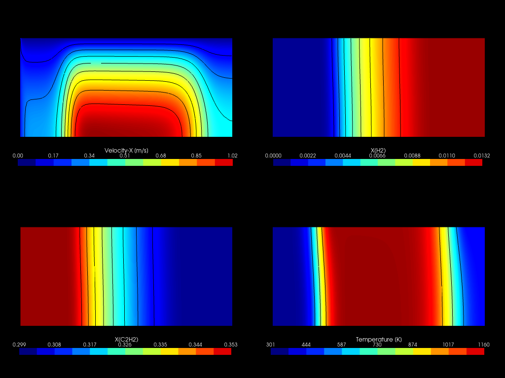
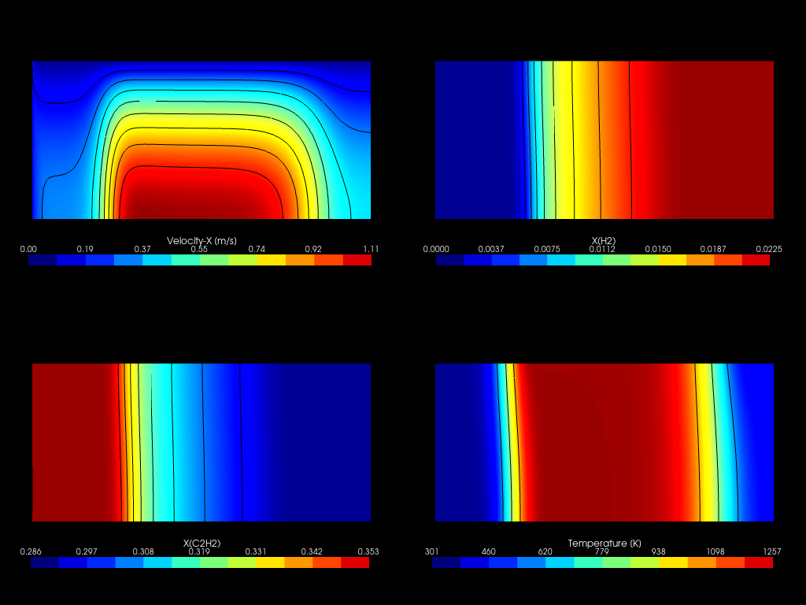
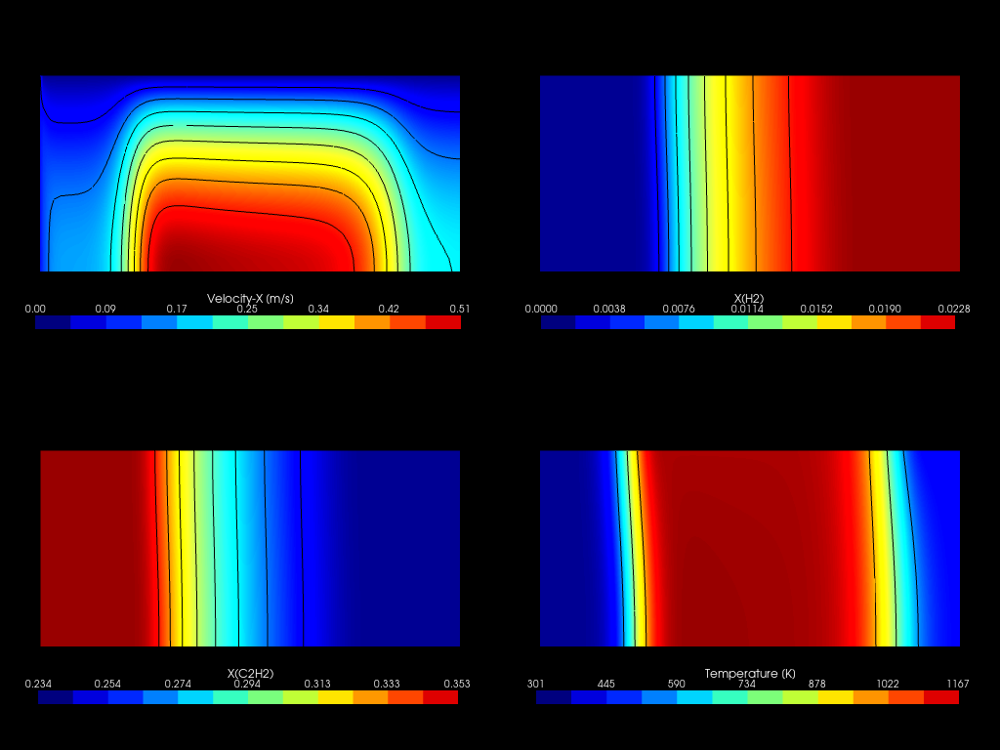
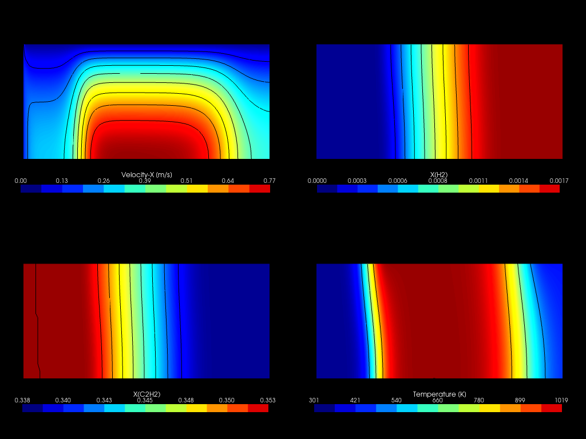
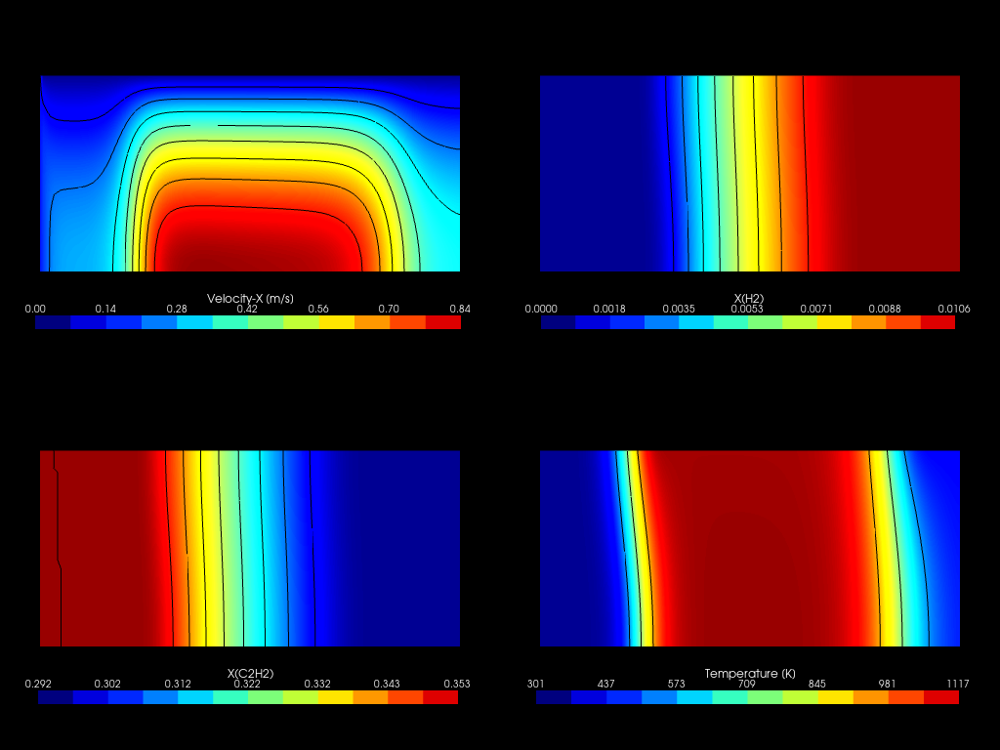

# Summary of results

    <h3>Case No. 4</h3>
    
    <h3>Case No. 5</h3>
    
    <h3>Case No. 6</h3>
    
    <h3>Case No. 7</h3>
    
    <h3>Case No. 8</h3>
    
    <h3>Case No. 9</h3>
    
    <h3>Case No. 10</h3>
    
    <h3>Case No. 11</h3>
    
    <h3>Case No. 12</h3>
    
    <h3>Case No. 13</h3>
    
    <h3>Case No. 14</h3>
    

<table>
    <tr>
        <td style="text-align: center;" width="50px">Case</td>
        <td style="text-align: center;" width="150px">Measured</td>
        <td style="text-align: center;" width="150px">PFR (Norinaga, 2009)</td>
        <td style="text-align: center;" width="150px">CFD (Skeletal model)</td> 
    </tr>
    <tr>
        <td style="text-align: center;">4</td>
        <td style="text-align: center;">0.346</td>
        <td style="text-align: center;">0.340</td>
        <td style="text-align: center;">0.336</td> 
    </tr>
    <tr>
        <td style="text-align: center;">5</td>
        <td style="text-align: center;">0.312</td>
        <td style="text-align: center;">0.321</td>
        <td style="text-align: center;">0.319</td> 
    </tr>
    <tr>
        <td style="text-align: center;">6</td>
        <td style="text-align: center;">0.307</td>
        <td style="text-align: center;">0.302</td>
        <td style="text-align: center;">0.299</td> 
    </tr>
    <tr>
        <td style="text-align: center;">7</td>
        <td style="text-align: center;">0.288</td>
        <td style="text-align: center;">0.287</td>
        <td style="text-align: center;">0.286</td> 
    </tr>
    <tr>
        <td style="text-align: center;">8</td>
        <td style="text-align: center;">0.323</td>
        <td style="text-align: center;">0.327</td>
        <td style="text-align: center;">0.323</td> 
    </tr>
    <tr>
        <td style="text-align: center;">9</td>
        <td style="text-align: center;">0.314</td>
        <td style="text-align: center;">0.320</td>
        <td style="text-align: center;">0.314</td> 
    </tr>
    <tr>
        <td style="text-align: center;">10</td>
        <td style="text-align: center;">0.249</td>
        <td style="text-align: center;">0.230</td>
        <td style="text-align: center;">0.234</td> 
    </tr>
    <tr>
        <td style="text-align: center;">11</td>
        <td style="text-align: center;">0.226</td>
        <td style="text-align: center;">0.219</td>
        <td style="text-align: center;">0.222</td> 
    </tr>
    <tr>
        <td style="text-align: center;">12</td>
        <td style="text-align: center;">0.201</td>
        <td style="text-align: center;">0.208</td>
        <td style="text-align: center;">0.216</td> 
    </tr>
    <tr>
        <td style="text-align: center;">13</td>
        <td style="text-align: center;">0.343</td>
        <td style="text-align: center;">0.342</td>
        <td style="text-align: center;">0.338</td> 
    </tr>
    <tr>
        <td style="text-align: center;">14</td>
        <td style="text-align: center;">0.298</td>
        <td style="text-align: center;">0.292</td>
        <td style="text-align: center;">0.292</td> 
    </tr>
</table>
